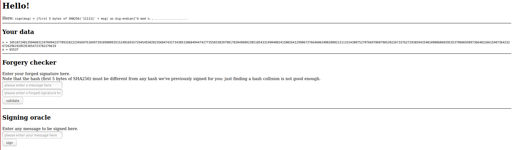

# Description

Forge an RSA signature for a signature scheme with short hash.

## Solution

The goal of the challenge is to forge a signature for a message that has never been signed before. The attack is possible because the signature scheme uses a short hash .

The attack used is a variant of the index calculus attack.

1.  Bruteforce the messages that factors in the factor base. See script.
2.  Take l linear independent vectors among the ones found
3.  Select a message you want to forge the signature for (it has to factor over the factor base)
4.  Compute the forgery. See script.
    - Express the vector of the message as a linear combination of the other vectors
    - Ask the oracle for the signature of the l messages
    - compute the forgery
