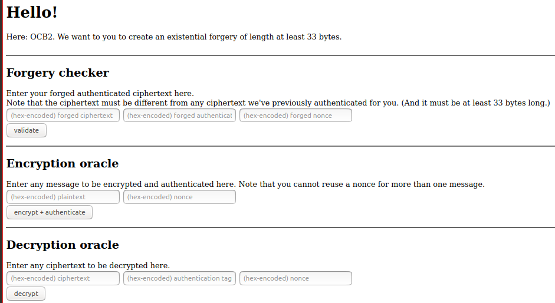

# Forgery for OCB2

Create an existential forgery of length at least 33 bytes



## Solution

Implementation of the existential forgery attack describted in the following paper:  
Akiko Inoue, Tetsu Iwata, Kazuhiko Minematsu, and Bertram Poettering: “Cryptanalysis of OCB2: Attacks on Authenticity and Confidentiality”

1. Crafting the message
    - Since we want our cipher text of length at least 33 bytes, we need at least 4 OCB blocs.
    - We craft the message such that the M[m-1] is the encoding of a full block (i.e. 16 bytes)
    - The other message blocks can be arbitrary. 
    - We use |M[4]| = 16 bytes  and A=0 for simplicity
2. Generate an arbitrary nonce
3. Let the oracle encrypt our message
4. Craft the forged ciphertext as described in the paper
5. Craft the forged tag as described in the paper
6. Let the oracle decrypt the forged ciphertext with the forged tag
    - If the decryption completes successfully, the forgery is correct: We managed to carry out an existential forgery against OCB2.


Executing the script
```shell
nonce: 68716e736f77646e797265706d6f6873 (b'hqnsowdnyrepmohs')
forged ciphertext: 329ebbe79e117c100cf8b8be863ab3be63905913c8114d2d24bf719ac326da9143f1b7a9fc741e2979e2f593d828eca5 (b'2\x9e\xbb\xe7\x9e\x11|\x10\x0c\xf8\xb8\xbe\x86:\xb3\xbec\x90Y\x13\xc8\x11M-$\xbfq\x9a\xc3&\xda\x91C\xf1\xb7\xa9\xfct\x1e)y\xe2\xf5\x93\xd8(\xec\xa5')
forged_tag: e91014700da5a60f66f835cf6cd064b7 (b'\xe9\x10\x14p\r\xa5\xa6\x0ff\xf85\xcfl\xd0d\xb7')
decrypted (correct): 1010101010101010101010101010101010101010101010101010101010101010c71aedd3b74cb3cca229fac6135f5146 (b'\x10\x10\x10\x10\x10\x10\x10\x10\x10\x10\x10\x10\x10\x10\x10\x10\x10\x10\x10\x10\x10\x10\x10\x10\x10\x10\x10\x10\x10\x10\x10\x10\xc7\x1a\xed\xd3\xb7L\xb3\xcc\xa2)\xfa\xc6\x13_QF')
Forgery successful. Sending forgery.
```
