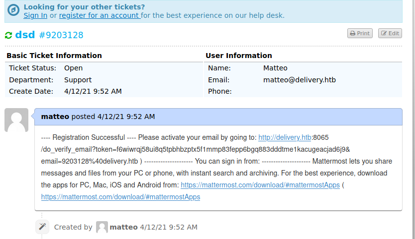
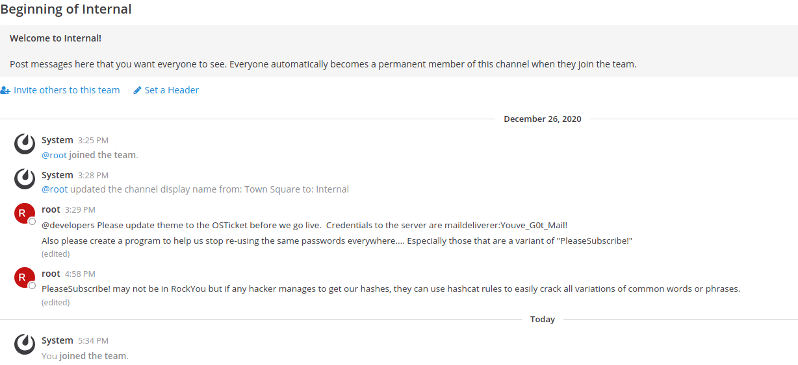

# Writeup

Start with usual nmap enumeration 
```
nmap -sC -sV -oN nmap-initial 10.10.10.222
```

Port 22 and 80 open where an nginx server is listening.  
We visit the service on port 80. The page contains links to 2 different domain name, namely helpdesk.delivery.htb and delivery.htb. We add them in our /etc/hosts file so that we can access them.

As described in the main page of delivery.htb we cannot access the Mattermost server if we don't have a delivery.htb account. The helpdesk server seems the first place we should look at.    
We start by poking around in the helpdesk servrer. We open a ticket and we get the following response message
```
zed, 

You may check the status of your ticket, by navigating to the Check Status page using ticket id: 9756656.

If you want to add more information to your ticket, just email 9756656@delivery.htb.

Thanks,

Support Team
```

If we move to the Check Status tab we can see the status of our ticket but nothing more than that.  

The first idea is to create a new delivery.htb account in the helpdesk server. However, once the registration completes, the account is locked until we confirm the sign in process through a verification email. A verification email that will obviously never arrive because the HTB machines do not talk to the internet.  

As a second idea we play with the osTicket api with the purpose of bypassing the verification of the account. This road is also a rabbit hole though.

The third idea is instead the successful one.   
We can visit the mattermost server and create an account. It again asks for a confirmation email if we want to finalize the registration. While the problem with the verification email is still the same we had before, we can now find a smarter way to keep the verification email inside of the HTB network. By looking closer at the previous response, namely
```
If you want to add more information to your ticket, just email 9756656@delivery.htb.
```
we suspect that each email sent to 9203128@delivery.htb will add information to the ticket, thus showing them in our Check Status tab.  
So, we create the account in the mattermost server with the email 9756656@delivery.htb, the content of the verification email will be visible in our Check status tab as supposed.



We follow the link in the email and we can login to the MatterMost server.




Once logged in we can retrieve the credentials for the server `maildeliverer:Youve_G0t_Mail!`. We try them in ssh and yes, they are correct!.  
We get in and we have the user flag.  It's time now to go for root.

## Root

We can enumerate the victim machine using linpeas.


Interesting stuff from linpeas' report
1. `* * * * *       root    /root/mail.sh `
2. binary permissions `85M -rwxrwxr-x 1 mattermost mattermost  85M Dec 18 08:53 /opt/mattermost/bin/mattermost`
3. `root       908  0.0  0.4  29544 18336 ?        S    10:27   0:00 python3 /root/py-smtp.py'

Nothing that we can exploit though.  

The /opt directory is very interesting because it usually contains user programs. It's very likely to configuration files with hardcoded credentials or useful info.

### config.json
This is an extract of the config.json file inside the mattermost directory under /opt

1.
```
"EnableGifPicker": true,
"GfycatApiKey": "2_KtH_W5",
"GfycatApiSecret": "3wLVZPiswc3DnaiaFoLkDvB4X0IV6CpMkj4tf2inJRsBY6-FnkT08zGmppWFgeof",
```

2.
```
"DriverName": "mysql",
"DataSource": "mmuser:Crack_The_MM_Admin_PW@tcp(127.0.0.1:3306)/mattermost?charset=utf8mb4,utf8\u0026readTimeout=30s\u0026writeTimeout=30s",
"DataSourceReplicas": [],
"DataSourceSearchReplicas": [],
"MaxIdleConns": 20,
"ConnMaxLifetimeMilliseconds": 3600000,
"MaxOpenConns": 300,
"Trace": false,
"AtRestEncryptKey": "n5uax3d4f919obtsp1pw1k5xetq1enez",
"QueryTimeout": 30,
"DisableDatabaseSearch": false
```


So we have 2 interesting things to look at. The first one is not sensible info though. Those are just the default api keys to select GIfs through the emoji picker.  
The second one is instead more interesting. We have in fact an username and a password for a mysql database.  
We thus try to connect to the mysql database: `mysql -u mmuser -p`. Obviously the password is `Crack_The_MM_Admin_PW`.  

Once we are in we take a look around, we enter the mattermost database (`use mattermost`) and we dump the valuable columns of the Users table.


```
MariaDB [mattermost]> select username,password,email,position,roles from Users;


+----------------------------------+--------------------------------------------------------------+----------------------------------+----------+--------------------------+
| username                         | password                                                     | email                            | position | roles                    |
+----------------------------------+--------------------------------------------------------------+----------------------------------+----------+--------------------------+
| redd                             | $2a$10$hKlb3XSk3jjLPd77EFtdCOM1W9NbHxZoOvaJ/oXED6Pk8ni44PGFq | 9050912@delivery.htb             |          | system_user              |
| lukaspre01                       | $2a$10$.qWymcm5r70PPx7M1ft4Ce2IYcizXWVbI5Uf6CYKLLtDurQC.h1LK | a@a.a                            |          | system_user              |
| surveybot                        |                                                              | surveybot@localhost              |          | system_user              |
| c3ecacacc7b94f909d04dbfd308a9b93 | $2a$10$u5815SIBe2Fq1FZlv9S8I.VjU3zeSPBrIEg9wvpiLaS7ImuiItEiK | 4120849@delivery.htb             |          | system_user              |
| 5b785171bfb34762a933e127630c4860 | $2a$10$3m0quqyvCE8Z/R1gFcCOWO6tEj6FtqtBn8fRAXQXmaKmg.HDGpS/G | 7466068@delivery.htb             |          | system_user              |
| vik0nd                           | $2a$10$Xvpuik3uk89i5BXNL.e0YesORDU3Zkq8EdNuDOjHxomo9.nFydq7S | vik0nd@delivery.htb              |          | system_user              |
| mario                            | $2a$10$XxiqFPPGPcsN/69AAEhWIOOAYBomsGUxgQ2vsxVlcwO4vGUvJNbx. | 300065@delivery.htb              |          | system_user              |
| visiter                          | $2a$10$p2haD2QwKc/a2whVopP.be5/kzD9j9Hidjz84PXZCZt5uL5Fh.8XS | 4808841@delivery.htb             |          | system_user              |
| root                             | $2a$10$VM6EeymRxJ29r8Wjkr8Dtev0O.1STWb4.4ScG.anuu7v0EFJwgjjO | root@delivery.htb                |          | system_admin system_user |
| ff0a21fc6fc2488195e16ea854c963ee | $2a$10$RnJsISTLc9W3iUcUggl1KOG9vqADED24CQcQ8zvUm1Ir9pxS.Pduq | 9122359@delivery.htb             |          | system_user              |
| kr01lap1324                      | $2a$10$RKyOCA.5z/qlrRv9lUMpwOrML.RSfNR3qULV.xhURSZV9Q0zdEUWm | fvfmbadwiqmvnazjmp@upived.online |          | system_user              |
| channelexport                    |                                                              | channelexport@localhost          |          | system_user              |
| 9ecfb4be145d47fda0724f697f35ffaf | $2a$10$s.cLPSjAVgawGOJwB7vrqenPg2lrDtOECRtjwWahOzHfq1CoFyFqm | 5056505@delivery.htb             |          | system_user              |
| test                             | $2a$10$qvQsc6MM7HCKfU8biKfUlOloiaDqKAB5Jt7rWMZAP1pS1PV94lUFa | test@test.test                   |          | system_user              |
| lukaspre0                        | $2a$10$2pbXtl5L.CcdxOMgLVV1iedACIN6vlxPQWGkP9YFebhz/icHS.fw6 | hogin71087@zefara.com            |          | system_user              |
| cha                              | $2a$10$cBEzQzkYyPip0qOWijE3L.53Igq2KllSXfm7wwLf901Vf1GWlsRNi | 2061649@delivery.htb             |          | system_user              |
+----------------------------------+--------------------------------------------------------------+----------------------------------+----------+--------------------------+
16 rows in set (0.001 sec)
```

The dump shows a dozen of usernames and hashes. Part of the accounts have been created by other HTB player when registering to the mattermost server.

We take the root hash and we give it to hashcat. As highlighted by the chat in the mattermost server we saw before, the candidate password is a variation of PleaseSubscribe!.  
Thus we try to crack the hash keeping this in mind.

We take 'PleaseSubscibe!' and we try its variations using the hashcat rules. There is no need of writing personal rules since hashcat provides some of the most common rules for password cracking. In kali Linux they are stored under /usr/share/hashcat/rules/.

```
> hashcat -a 0 -m 3200 hash pass -r /usr/share/hashcat/rules/bes t64.rule

...
$2a$10$VM6EeymRxJ29r8Wjkr8Dtev0O.1STWb4.4ScG.anuu7v0EFJwgjjO:PleaseSubscribe!21
...
```

Cracked the hash, we can login as the root user: `su -` with password PleaseSubscribe!21

The root flag is there waiting for us.

