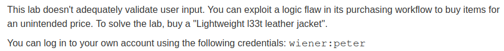
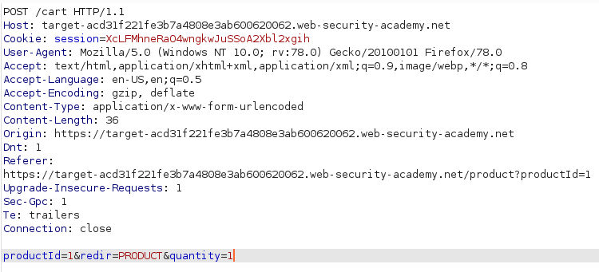
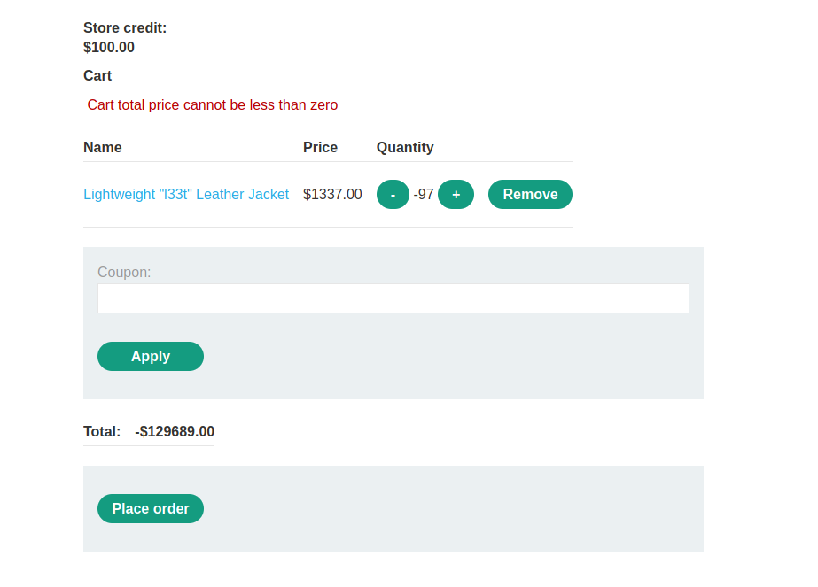
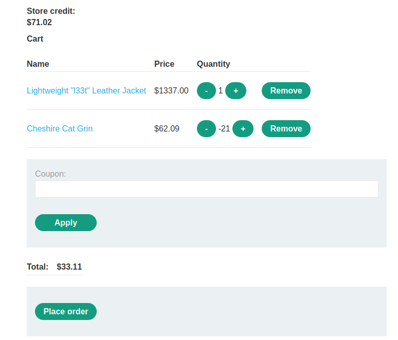
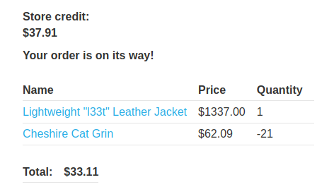

# High-level logic vulnerability

## Description
Link: https://portswigger.net/web-security/logic-flaws/examples/lab-logic-flaws-high-level

>

## Writeup

We move through the website while recording the HTTP traffic using Burp.

When an item is added to the cart, the request looks like this one:

>

The item's **productID** and **quantity** are specified in the POST body and sent to the server (The `productId=1` represents our `Lightweight l33t leather jacket`).

We change the **quantity** to -100. Since quantity is not properly validated, our cart will have a negative value. trying to place the order for that cart, we get an error:

>

The server checks for the cart's total and throws an error if the quantity is negative.  
However, since we can add negative quantities for items, we can use them to make the cart's value lower (while keeping it positive). In this way we are able to afford our dream jacket.

>

Placing the order, we manage to buy a 1337 dollar jacket for 33.11 dollars (we could lower the price up to 0.01 if we really want to save money :) )

>