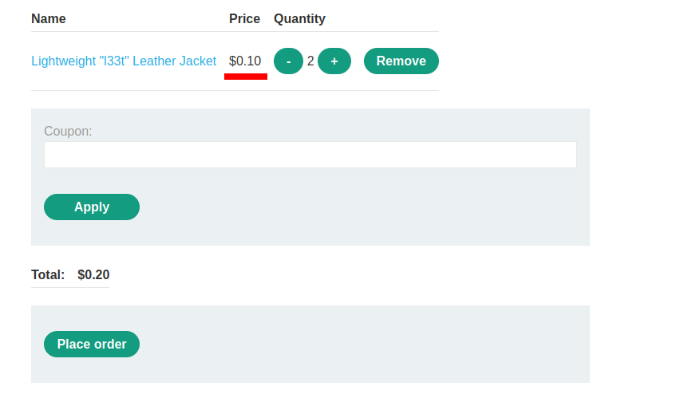

# Excessive trust in client-side controls

## Description

Link: https://portswigger.net/web-security/logic-flaws/examples/lab-logic-flaws-excessive-trust-in-client-side-controls

>

## Writeup

Goal of the challenge is to buy a `Lightweight l33t leather jacket`.  

We first login to our account. We only have 100 dollars and the jacket we want to buy is way too expensive for us (1337 dollars):

>

We add the `Lightweight l33t leather jacket` to our cart and try to place the order.  
As expected we are not allowed to, because we don't have enough credit

>

We can fire up Burp while we perform different kind of operations in order to log the requests and responses.

Taking a look at the generated HTTP traffic, we notice a specific HTTP request, containing the product id and the price of the item.

>

This request is generated when an item is added to the cart. 

We can try to lower the price of the item (`productId=1` is for our `Lightweight l33t leather jacket`):

>

And we see that the price is actually changed:

>

Placing the order, we can now buy each `Lightweight l33t leather jacket` for 0.10 dollars. Not bad !

