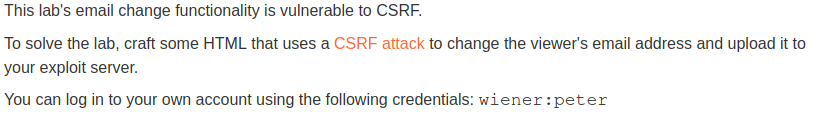
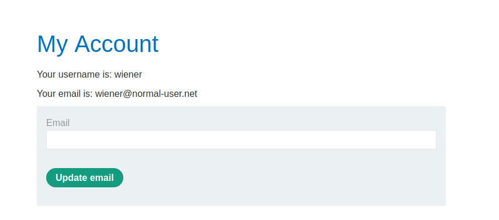
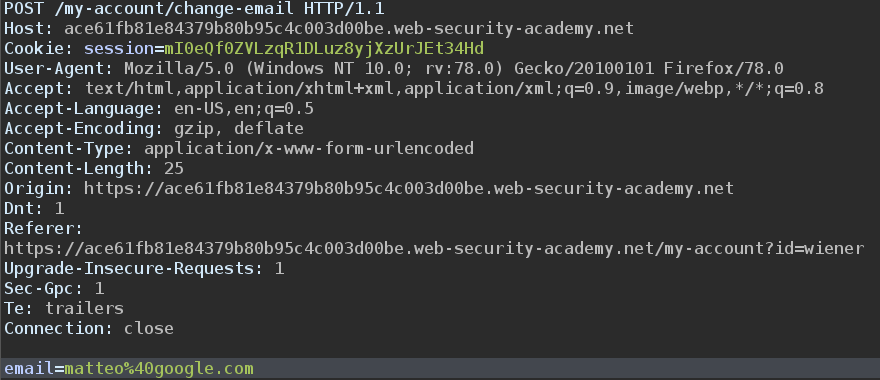
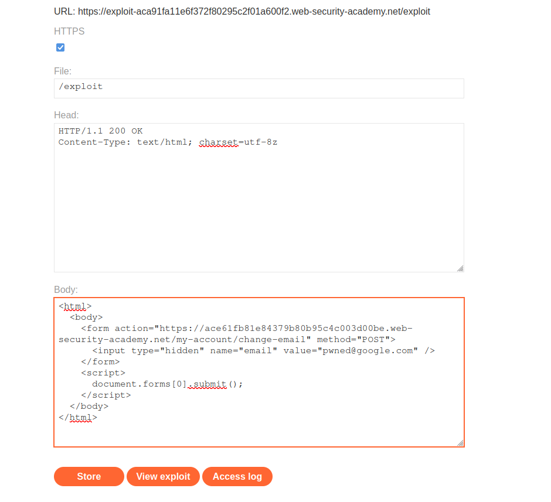

# CSRF with no defenses in place

## Description

Link: https://portswigger.net/web-security/csrf/lab-no-defenses

>

## Writeup

We can login to our account with the credentials we have `wiener:peter`.

Once logged it we are redirected to our account page

>

Here we can change our email by providing a new email.

We fire up Burp in order to record the `update email` request and analyze it

>

The new email is specified in the POST body and url encoded. 

Since there aren't any CSRF protections we can simply make the victim issue a `change email` operation and hardcode the new email in the post body. 

The response that we will serve back to the victims when they visit the `/exploit` page is the following:

>

The form will be submitted without any user interaction and they email will be changed to **pwned@gmail.com**.

The CSRF attack succedeed.