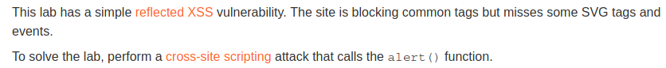
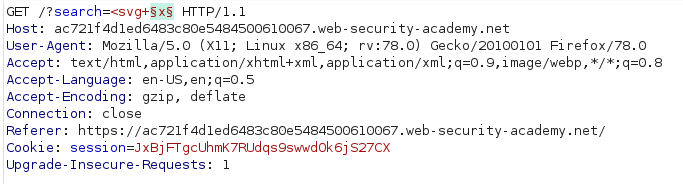
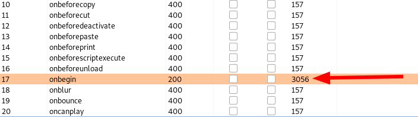
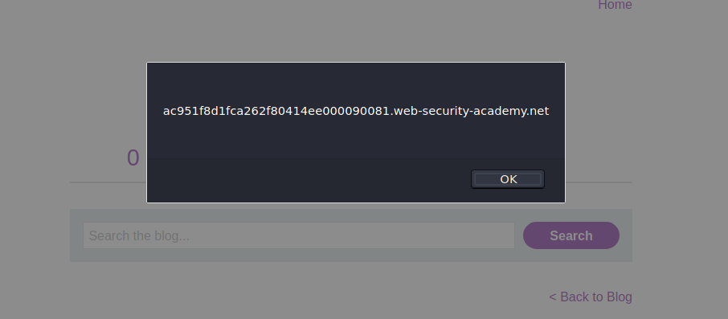

# Reflected XSS with some SVG markup allowed

## Description

Link: https://portswigger.net/web-security/cross-site-scripting/contexts/lab-some-svg-markup-allowed

>

## Writeup

We know the `svg` tag is going to be successful.

We try `<svg onload=alert(1)` but the `onload` event is blacklisted.

What we can do is fuzzing the event attribute to figure out which event is allowed.  

We can do it using Burp intruder.  
The request we crafted is 

>

Our dictonary is a wordlist file with all the `events`.

Running Intruder we get to know that the `onbegin` event is whitelisted:

>


We can exploit it and craft our XSS payload. We try a couple of different payloads, then we find the right one using the `animatetransform` tag:

```
<svg><animatetransform onbegin=alert(document.domain) attributeName=transform>
```

>


