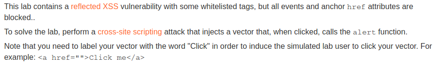
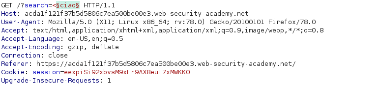
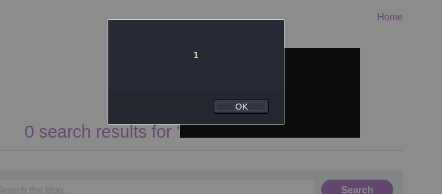
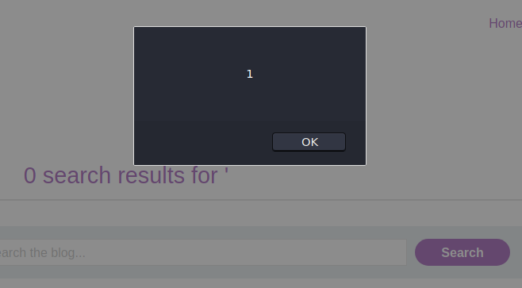

# Reflected XSS with event handlers and href attributes blocked
## Description

Lab: https://portswigger.net/web-security/cross-site-scripting/contexts/lab-event-handlers-and-href-attributes-blocked

>

## Writeup

So event handlers and `href` attribute are blacklisted.

Let's use Burp intruder to see whether we have any tags that we can use.

>

We can take the  complete list of html tags from https://portswigger.net/web-security/cross-site-scripting/cheat-sheet.

Some of the whitelisted tags are `svg`, `animate` and `a`. We can use them to our advantage and easily trigger our javascript.

In particular we exploit the  `animate` tag and its `attributeName` attribute. Such attribute specifies the name of the CSS property or attribute of the target element that is going to be changed during an animation. 

So, by specifying `href` as the value of `attributeName` we can manipulate and assign values to the `href` attribute without being blocked.

We can craft our XSS payload: `<svg><a><circle r='400' /> <animate attributeName=href values="javascript:alert(1)"></a>`

>

The XSS is indeed working but it is not pretty enough. The challenge wants us to provide a clickable link that the unsuspicious victim could fall for.

We can easily do it by replacing the `circle` tag with the SVG`text` element.

The payload is now: `<svg><a><text x="20" y="35" class="small">Click here</text> <animate attributeName=href values="javascript:alert(1)"></a>`

And now the XSS is way smoother. Still not that pretty but enough to pass the challenge.

>

Clicking it will trigger the XSS

>