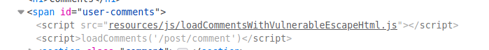

# Stored DOM XSS

## Description

Link: https://portswigger.net/web-security/cross-site-scripting/dom-based/lab-dom-xss-stored

>

## Writeup

A comment feature is implemented within each post in the page

>

We can test each field for XSS, starting with the simple ``.

>

Some filtering is in place.

We can study the source code of the page to see whether the escaping is performed client side.  
Something interesting pops up:

>

Zooming into the javascript file we can analyze the code: Some HTML characters are escaped

>

And this is what the function `escapeHTML` does

>

It sanitizes the characters `<` and `>` by using the `replace()` function. However such function will only replace the first instance of the value.

We can easily bypass the escaping by prepending  `<>` to our payload.

However `<> ` doesn't seem to work.  
At this point we can try a bunch of different payloads and see whether the XSS is triggered or not.

Payload `<>` is successful.

>

