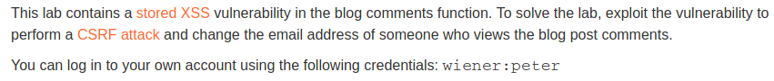
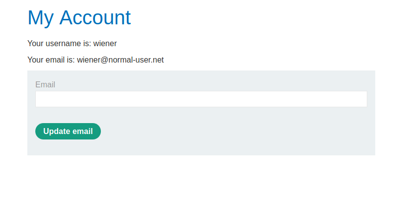
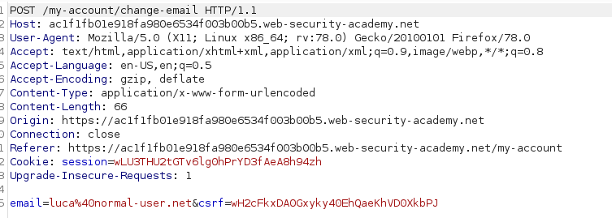
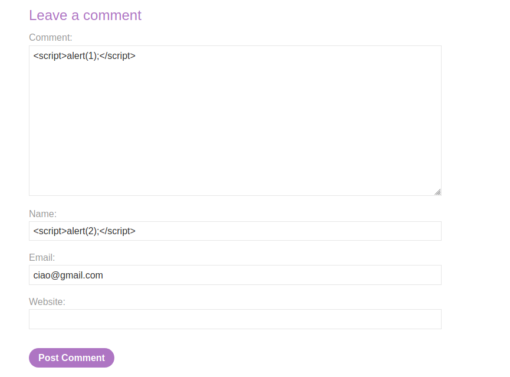
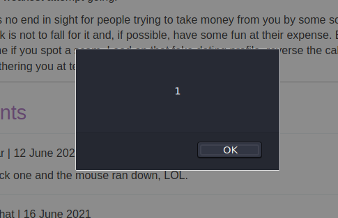
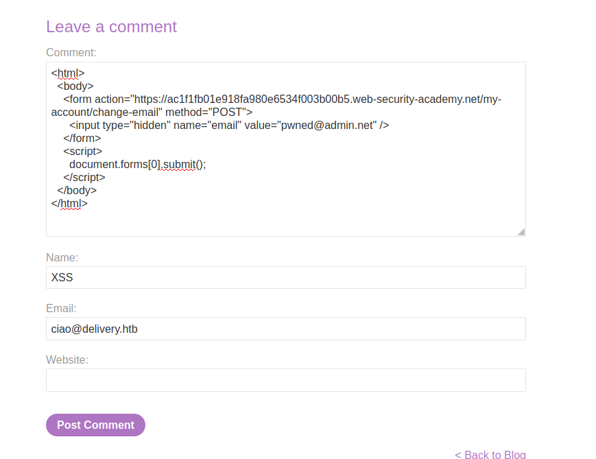

# Exploiting XSS to perform CSRF

## Description

Link : https://portswigger.net/web-security/cross-site-scripting/exploiting/lab-perform-csrf

>


## Writeup

We know that the vulnerability is in the blog comments.  

First thing we want to do is find the XSS and trigger it

We log in as the **wiener** user, as suggested in the description. 

The following page is served to us:

>

The final goal of the challenge is to change the email address of another user. So, what we can do now is to intercept our `update email` request so that we know how the update mechanism works.

We use Burp for this purpose. We update the email to luca@normal-user.net and this is the HTTP request we intercepted:

>


By changing the value of the `email` POST variable we can change our own email. Moreover we can see that the page has a CSRF token.

TODO: What does this token do?


looking for the XSS we can try to trivial `<script>` tag in the comment and name section:

>

And we can identify the XSS in the _comments_ input field

>


We can now use it to perform a CSRF attack and change the password of the user that will visit the page.

Since the mail is changed with a POST request, we need to trick the user to perform a POST request too. We can do it by creating a form


```
<html>
  <body>
    <form action="https://vulnerable-website.com/email/change" method="POST">
      <input type="hidden" name="email" value="pwned@evil-user.net" />
    </form>
    <script>
      document.forms[0].submit();
    </script>
  </body>
</html>
```

So we try this 

>

But it doesn't trigger because it says that the `csrt` is missing. However given that we can execute javascript, we can crape the page to dynamically get the csrt of the victim and submit it together with the email.  


