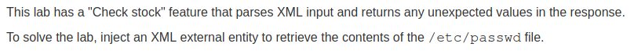
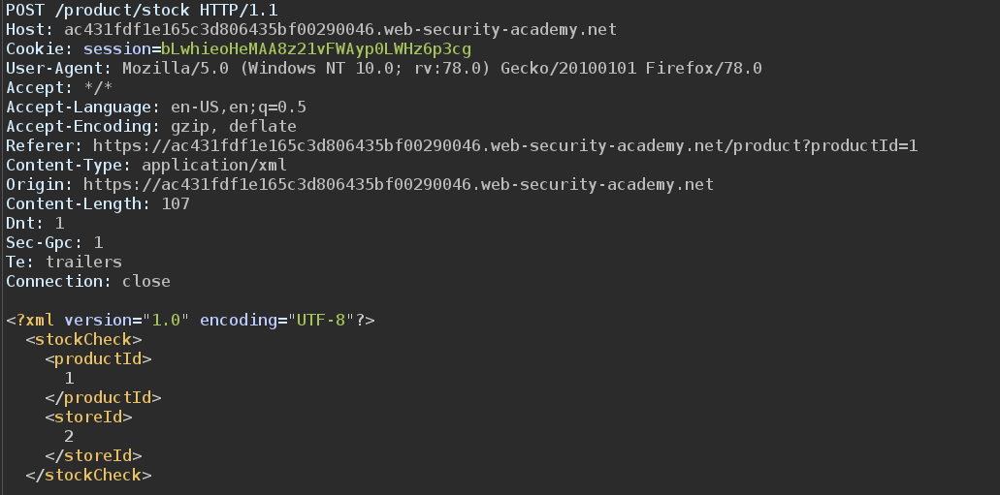
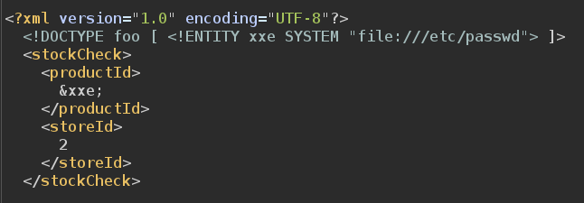
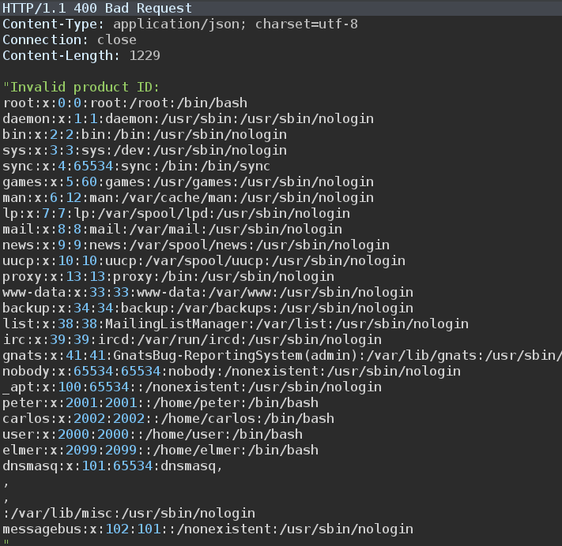

# XXE using external entities to retrieve files

## Description

Link: https://portswigger.net/web-security/xxe/lab-exploiting-xxe-to-retrieve-files

>

## Writeup

The website offers a `check stock` feature that displays the number of items of a specific product in one of the shops.  

Each product has an id, as well as each shop.

We can intercept the request using Burp

>

The XML is passed to the server, processed and the response is displayed in the web page.

Since no protections are in place, we can load sensitive files using the external entities. We change the XML as follows:

>

It will load the content of the `/etc/passwd` file in the `xxe` entity. The server will respond with an error message (since the product ID is not valid) and will print the content of `/etc/passwd` file:

>

We successfully managed to perform an XXE attack to exfiltrate sensitive information.