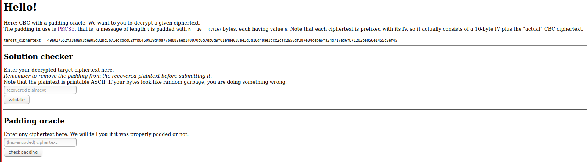

# Description

Implement a padding oracle attack against the AES-CBC scheme

## Solution

The solution is fully taken from Corvus Crypto, https://www.youtube.com/watch?v=QhuUvrrGJbE, with some minor adjustment to work with the oracle provided.

Full credits to him.

