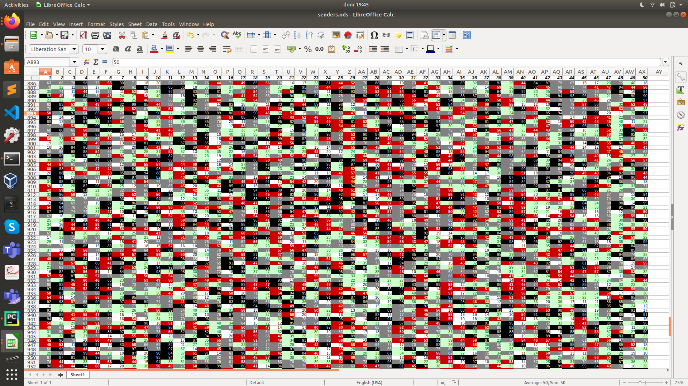
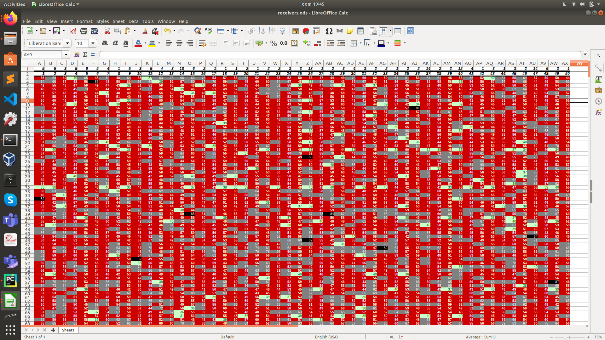

# Description

Find a clique of "criminals" based on the input-output behaviour of an imaginary mixnet with 50 participating clients.  
More specifically, you are provided with two files: One tells you, for each time frame, how many messages each person sent to the mix. The other tells you how many messages everyone received in each time frame. While most of the traffic is random cover traffic, there is a subset of people talking to each other; your task is to find out who is part of that group.

Input and output data are in this folder.

## Solution

We analyze the data using LibreOffice Sheet.  
We copy the data in LibreOffice and we add a conditional formatting in order to highlight the different bands of values (1-20,21-40,41-60,61-80,80+).  

This is the senders sheet

This is the receivers sheet

As we can see, the number of packets received is quite balanced. However, since the random traffic is not influenced by the criminals' communication, then we expect that the members of the clique receive more than normal users (random traffic + clique's traffic).  

We can deanonymize the criminals by identifying the people who repeatedly receive a high number of packets (e.g 80+ packets).  
The first row in the receivers sheet reports this count.
