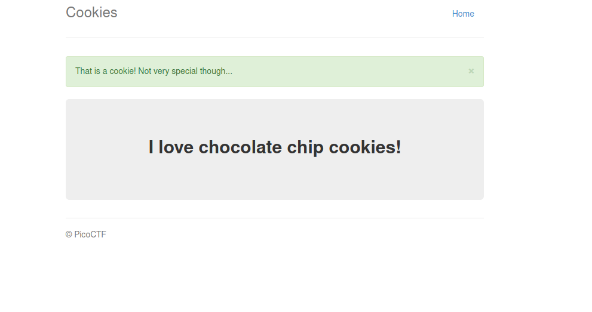
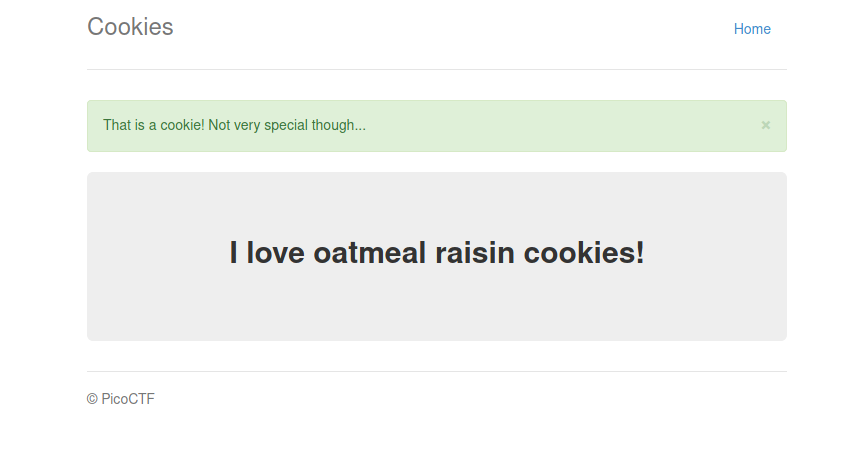

# My solution


### Path 1 (unsuccessful)

As the name of the challenge suggests, we focus our attention on cookies.  


```
> echo -n "eyJfZmxhc2hlcyI6W3siIHQiOlsiZGFuZ2VyIiwiVGhhdCBkb2Vzbid0IGFwcGVhciB0byBiZSBhIHZhbGlkIGNvb2tpZS4iXX1dfQ.YFcG0g.P78in9OeYQfj-5A-IkaIdy9l_a4" | base64 -d

{"_flashes":[{" t":["danger","That doesn't appear to be a valid cookie."]}]}base64: invalid input
```

As we see the string "That doesn't appear to be a valid cookie." is then displayed on the screen. The "danger" string is also by the backend to display a red banner containing the error message.  
We can thus try to manipulate the cookie in order to solve the challenge.  

We try to see whether we can actually change the error message by changing the cookie.   
First we craft our cookie

```
echo -n '{"_flashes":[{" t":["danger","Banner changed"]}]}' | base 64
```

This path was unfruitful

### Path 2 (successful)

By analyzing the flow of the requests and responses we see that:   
- When a request is done to /search, a session cookie is set in the user environment and the web browser is redirected to the / page.
- When a request with `Cookie: name=1` is performed, the web browser is redirected to a page /check and then a different page is displayed. Namely:




- When a request with `Cookie: name=2` is performed, a different string is displayed on the page. Namely:




By tweaking the `Cookie: name=x`, we find the flag at x=18


